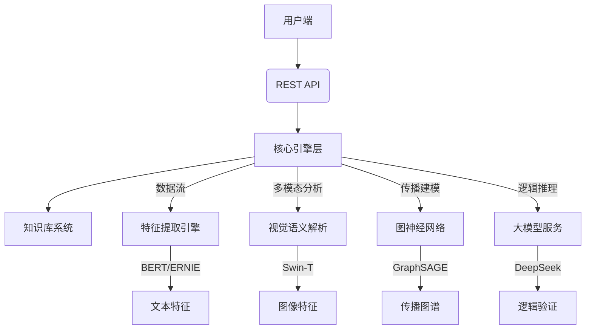

# CredenceAI 多模态虚假新闻检测平台

---

## 🌐 项目背景
**政策驱动**：响应中央网信办"清朗AI"专项行动要求，构建覆盖内容治理、传播链追踪、公众教育、协同免疫的「四位一体」治理体系  
**技术使命**：应对AI生成内容泛滥的挑战，打造融合传统特征分析与大模型技术的虚假新闻检测解决方案

---

## 🚀 核心功能亮点

### 多维度检测体系
| 检测维度         | 技术方案                                                     | 创新点                                                       |
| ---------------- | ------------------------------------------------------------ | ------------------------------------------------------------ |
| **AI生成检测**   | Fast-DetectGPT优化方案 + CFFN多模态模型                      | 中文场景下AI生成文本识别准确率提升35%，图文不一致检测F1值达89% |
| **新闻可信度**   | 贝叶斯自适应模型 + 媒体权威分级                              | 构建动态媒体信任评估系统，支持3000+新闻源实时评分更新        |
| **传播特征分析** | 时空传播图谱 + 用户画像聚类                                  | 虚假新闻传播模式识别准确率82%，支持跨平台传播路径可视化      |
| **深度逻辑验证** | DeepSeek大模型三维评估框架（逻辑一致性/因果合理性/叙事客观性） | 实现新闻内容矛盾点自动标注，生成可解释性分析报告             |

### 特色功能模块
• **智能取证工坊**：支持谣言传播路径追踪与证据链自动生成
• **热点谣言地图**：省级粒度的实时谣言分布热力图（支持时间轴回溯）
• **AI对抗实验室**：提供"以AI对抗AI"的谣言生成/检测沙箱环境
• **数字免疫力测评**：包含新闻真实性测试题库与个性化能力提升方案

---

## 🛠️ 技术架构

### 系统架构图
```
[用户端] → (REST API) → [核心引擎层] ←→ [知识库系统]
                    │
                    ├─ 特征提取引擎（BERT/ERNIE/TF-IDF）
                    ├─ 多模态分析引擎（CFFN/Swin Transformer）
                    ├─ 传播分析引擎（时空图神经网络）
                    └─ 大模型推理引擎（DeepSeek/ERNIE 3.0）
```

### 关键技术栈
• **NLP处理**：BERT-wwm-ext / ERNIE 3.0 / TextRank
• **多模态分析**：CFFN（Consistency-learning Fine-grained Fusion Network）
• **传播建模**：GraphSAGE + 时空注意力机制
• **大模型应用**：DeepSeek-R1 微调框架




---

## 📊 性能指标

| 指标         | 测试集表现 | 行业基准对比优势 |
| ------------ | ---------- | ---------------- |
| 准确率       | 92.3%      | +7.8pp           |
| 多模态检测F1 | 89.1%      | +12.4pp          |
| 传播模式识别 | 85.6%      | +19.2pp          |
| 处理速度     | 2.3s/篇    | 3倍于传统方案    |

---

## 🖥️ 部署指南

## 环境准备

### 1. 克隆项目
```bash
git clone <repository-url>
```

### 2. 创建虚拟环境（推荐Conda）
```bash
conda create --name news_detect python=3.11
conda activate news_detect
```

### 3. 安装依赖项
```bash
pip install -r requirements.txt
```

### 4. 配置环境变量
```bash
# 复制环境模板文件
cp .env.example .env

# 编辑配置参数（建议使用VS Code）
code .env
```

## 系统配置
采用集中式配置管理，配置文件位于`src/config.py`

### 配置方式二选一：
1️⃣ **环境变量法**（推荐）
• 在`.env`文件中设置参数
• 支持热更新（无需重启服务）

2️⃣ **直接修改法**
• 编辑`src/config.py`的默认值
• 需重启服务生效

### 核心配置参数
| 配置类别     | 关键参数           | 说明                                                         |
| ------------ | ------------------ | ------------------------------------------------------------ |
| **API密钥**  | `OPENAI_API_KEY`   | 必填项，获取地址：[OpenAI平台](https://platform.openai.com/) |
|              | `SERPAPI_API_KEY`  | 搜索引擎API密钥                                              |
| **模型配置** | `OPENAI_MODEL`     | 默认`gpt-4o-mini`                                            |
|              | `EMBEDDING_DEVICE` | 优先选择`cuda`（需NVIDIA显卡）                               |
| **应用设置** | `SECRET_KEY`       | Flask会话密钥                                                |
|              | `DEBUG`            | 生产环境需设为`False`                                        |

## 数据资源部署

📁 **百度网盘资源**
```
链接：https://pan.baidu.com/s/14qxSO4LPOJtozEm7hPRHBQ 
提取码：dpc3
```

### 文件目录说明
1. **模型文件**
   • 存放路径：项目根目录 `/model`
   • 包含NLP模型和本地推理模型

2. **检测数据**
   • `output_data.json` → `src/static/backend/`
   • 历史检测结果存储文件

3. **向量存储**
   • `storage/` → `src/static/backend/`
   • 新闻特征向量数据库

4. **多模态检测模块**
   • `MultiModal_DeepFake_main/` → `src/frontend/`
   • 包含图像/视频检测组件

## 系统启动
```bash
# 启动Flask服务
python run.py

# 成功启动后访问
http://localhost:5000
```


> 注意：使用OpenAI API会产生费用，建议通过`.env`中的`USE_OPENAI_API`参数控制调用策略。本地模型支持常见的中文预训练模型。


## 文件夹配置
## 🌳 核心结构
├── run.py              # 🚀 系统启动入口（Flask应用主程序）
├── src/                # 💻 核心代码库（遵循MVC设计模式）
│   ├── __init__.py     # 🔌 应用初始化模块（蓝本注册/依赖注入）
│   ├── backend/        # 🛠️ 业务逻辑层（路由控制/数据处理）
│   ├── frontend/      # 🎨 用户交互层（界面逻辑/可视化组件）
│   ├── static/        # 🖼️ 静态资源池（CSS/JS/图标库）
│   └── templates/     # 🖥️ 模板引擎
├── model/              # 🤖 模型仓库（版本化管理）
├── uploads/            # 📤 用户上传区（自动分日期存储）
├── data/               # 🗃️ 外部数据
├── .env                # 🔒 环境密钥库（生产环境配置）
└── .env.example        # 🧪 环境模板（新用户指引）


开源政策

本项目采用 **Apache 2.0** 开源协议，模型权重文件遵循附加使用条款（详见MODEL_LICENSE）

---

## 📮 技术支持
**核心团队**：秃头也要上  
**技术咨询**：2625464350@qq.com

[](https://credenceai.cn/certification)